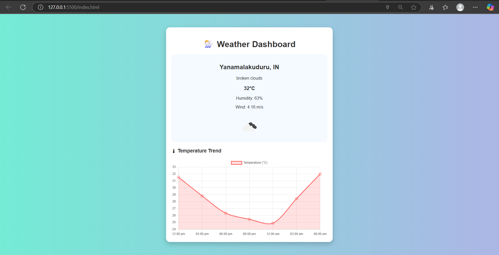

# Dynamic Weather Dashboard

A responsive weather dashboard that automatically detects your location 🌍 and shows real-time weather data with a temperature trend graph 📊.  

Built with **HTML, CSS, JavaScript, Chart.js**, and **OpenWeatherMap API**.

---

## ✨ Features
- ✅ Auto-detects current location using **Geolocation API**  
- ✅ Displays real-time weather (temperature, description, humidity, wind)  
- ✅ Weather icons for better UI  
- ✅ Temperature trend graph using **Chart.js**  
- ✅ Responsive, modern design  

---

## 🖼️ Demo
🔗 [Live Demo]()  
(Add your GitHub Pages link here once deployed)

---

## 📷 Screenshots


---

## 🚀 Getting Started

### 1️⃣ Clone the Repo
```bash
git clone https://github.com/your-username/weather-dashboard.git
cd weather-dashboard
